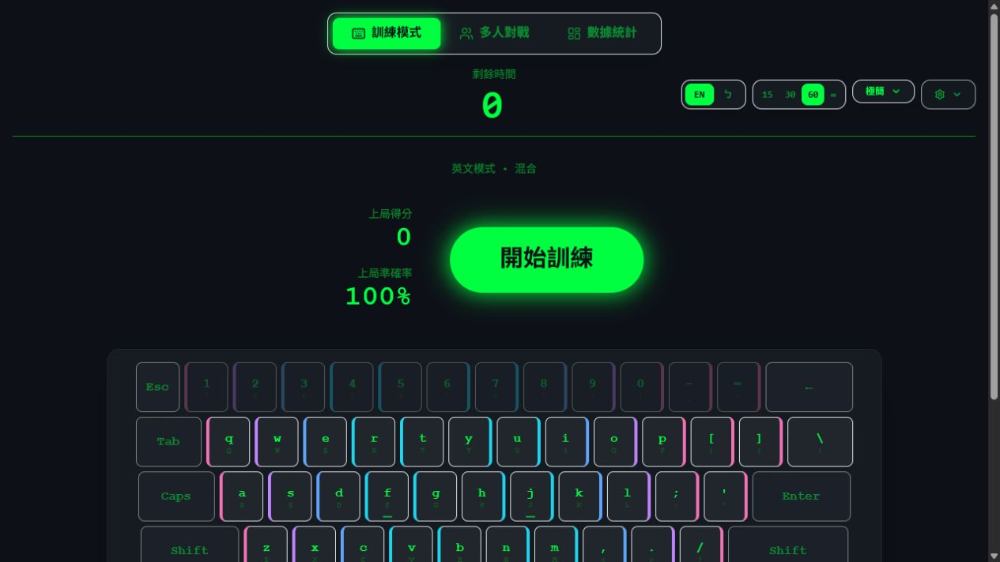
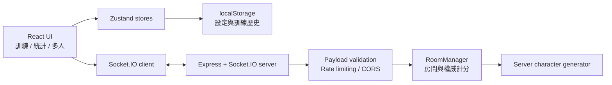
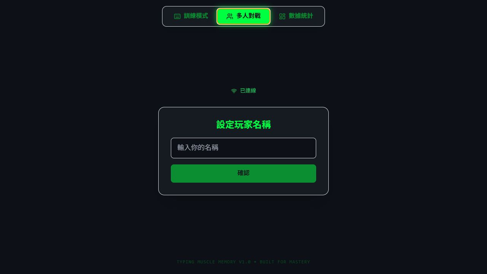

# Typing Training Lab

[繁體中文](#繁體中文) · [English](#english) · [Live Demo](https://typing-solo-demo.vercel.app)

A bilingual keyboard-training lab with custom drills, local performance analytics, and validated real-time multiplayer rooms.



## 繁體中文

Typing Training Lab 是一個以 React、Zustand 與 Socket.IO 製作的鍵盤訓練作品。它不只顯示打字速度，還會記錄按鍵延遲、錯誤分布及弱項按鍵，並支援英文、注音與多人即時對戰。

### 功能

- 英文與注音訓練，支援大小寫、時間、鍵盤列、左右手及自訂按鍵。
- 四種介面主題、音效與虛擬鍵盤提示。
- 本機統計：準確率、PPM、平均延遲、錯誤按鍵與歷史紀錄。
- 2–4 人 Socket.IO 房間、快速配對、準備狀態、即時排行與結果頁。
- 前後端共 20 個單元／整合測試，涵蓋計分、字元生成、Zustand stores、RoomManager、輸入驗證及 rate limiter。
- Playwright 以兩個隔離瀏覽器情境驗證建立房間、加入、雙方準備、同步開局及伺服器權威計分。

### 多人模式安全設計

- 分數由伺服器依照該玩家目前題目判定；瀏覽器不能自行回報「答對」。
- 房間名稱、玩家名稱、房間代碼、遊戲設定及單次按鍵皆有格式與長度限制。
- Socket 事件設有頻率限制；單一房間最多 4 人，伺服器最多保留 100 個房間。
- 至少兩名已連線玩家都準備完成才會開始；過期房間會定期清除。
- CORS 僅允許明確列出的前端來源，可用 `ALLOWED_ORIGINS` 覆寫。

> 這是作品集等級的示範服務，房間只存於記憶體，沒有帳號系統或永久玩家資料。若要用於正式競賽，仍應加入身分驗證、共享狀態儲存與可觀測性。

### 架構



### 線上展示與 Render 冷啟動

- 前端：[Vercel Live Demo](https://typing-solo-demo.vercel.app)
- 多人伺服器：Render

Render 的免費服務閒置後可能休眠。第一次進入多人模式時，畫面可能顯示「連線中」約 30–60 秒；服務喚醒後會自動連線，不需重新整理。這是展示環境的限制，不是前端錯誤。



### 本機執行

需求：Node.js 22+。

```bash
# 前端
npm ci
npm run dev

# 另一個終端啟動多人伺服器
npm ci --prefix server
npm --prefix server run dev
```

建立 `.env.local`：

```env
VITE_WEBSOCKET_URL=http://localhost:10000
```

伺服器可選環境變數：

```env
PORT=10000
ALLOWED_ORIGINS=http://localhost:5173,https://your-site.example
```

### 品質檢查

```bash
npm run check
npm run test:e2e
npm audit --omit=dev
npm audit --prefix server --omit=dev
```

GitHub Actions 會在 push 與 pull request 執行前後端 lint、test、build、Playwright 雙人流程及 production dependency audit。Dependabot 每週檢查前後端 npm 套件，每月檢查 GitHub Actions。

### 授權

本專案採用 [MIT License](./LICENSE)。

---

## English

Typing Training Lab is a React, Zustand, and Socket.IO portfolio project for deliberate keyboard practice. It tracks more than raw speed: each session records accuracy, key latency, error distribution, and weak keys, with English, Zhuyin, and real-time multiplayer modes.

### Features

- English and Zhuyin drills with case, duration, keyboard-row, hand, and custom-key controls.
- Four visual themes, audio feedback, and a virtual keyboard.
- Local analytics for accuracy, PPM, average latency, mistakes, and session history.
- 2–4 player Socket.IO rooms with quick match, ready state, live ranking, and results.
- 20 client/server unit and integration tests covering scoring, character generation, Zustand stores, RoomManager, payload validation, and rate limiting.
- A two-context Playwright test covers room creation, joining, both players becoming ready, synchronized game start, and server-authoritative scoring.

### Multiplayer hardening

- The server compares each input with the player's expected character; clients cannot award themselves points.
- Room names, player names, room IDs, game settings, and key input are validated and bounded.
- Socket events are rate-limited; rooms are capped at four players and the server at 100 rooms.
- A game requires at least two connected, ready players. Stale rooms are pruned automatically.
- CORS uses an explicit allowlist that can be replaced with `ALLOWED_ORIGINS`.

> This is a portfolio-grade demo. Rooms are in memory, and there is no account or persistent player-data layer. A production tournament would also need authentication, shared state, and observability.

### Architecture

The Mermaid diagram in the Traditional Chinese section shows the complete data flow: the training experience stays local, while multiplayer input crosses the validated Socket.IO boundary and is scored by RoomManager on the server.

### Live demo and Render cold starts

- Frontend: [Vercel Live Demo](https://typing-solo-demo.vercel.app)
- Multiplayer server: Render

The free Render service may sleep after inactivity. On the first multiplayer visit, “Connecting” can remain visible for roughly 30–60 seconds while the service wakes. The client reconnects automatically; no refresh is required.

### Run locally

Requires Node.js 22+.

```bash
npm ci
npm run dev

# In another terminal
npm ci --prefix server
npm --prefix server run dev
```

Create `.env.local`:

```env
VITE_WEBSOCKET_URL=http://localhost:10000
```

Optional server variables:

```env
PORT=10000
ALLOWED_ORIGINS=http://localhost:5173,https://your-site.example
```

### Verify

```bash
npm run check
npm run test:e2e
npm audit --omit=dev
npm audit --prefix server --omit=dev
```

GitHub Actions runs client/server lint, tests, builds, the two-player Playwright flow, and production dependency audits for every push and pull request. Dependabot checks both npm workspaces weekly and GitHub Actions monthly.

### License

This project is available under the [MIT License](./LICENSE).

### Optional Google Sheets sync

Solo-session results can optionally be appended to Google Sheets through the included Google Apps Script receiver. Anonymous visitors are routed to the public statistics sheet without showing a sync message. A valid private token, stored only in that browser, routes the session to the owner's separate personal sheet and enables the private sync status. Local history remains authoritative and available when the endpoint is absent or offline; uploads use an idempotent local queue with automatic and manual retry.

Copy `.env.example` to `.env.local`, set `VITE_GOOGLE_SHEETS_WEB_APP_URL`, and follow the schema and deployment guide in [`google-apps-script/README.md`](./google-apps-script/README.md). Do not commit spreadsheet ids, credentials, private tokens, or private data.
